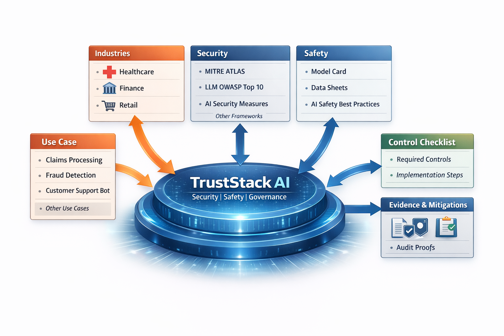
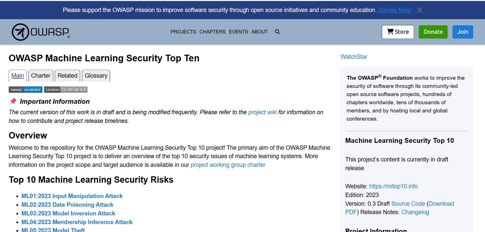

# TrustStack AI GRC — **AI GRC Workbench**


**Tagline:** Config-driven packs → controls → evidence → audit-ready.  
**Control panel:** TrustStack AI Assurance Hub  
**Repo:** `controlforge`

TrustStack AI GRC turns AI regulations and security frameworks into a **practical, trackable checklist** for a specific AI use case — and helps you **store evidence** and produce an **audit-ready report**.

## Application Screenshot


## Project Contributors
This project is being led by **Adnan Masood** and **Heather Dawe** for their upcoming book.

- **Adnan Masood, PhD** - Adnan is a seasoned artificial intelligence and machine learning expert, currently serving as **Chief AI Architect** leading AI strategy, engineering, and governance at UST. He holds a PhD in AI/ML, has been a **Stanford Visiting Scholar** and **Harvard Business School alum**, and is recognized as a thought leader, author, and speaker in responsible and enterprise-grade AI. He has co-authored books on responsible AI and regularly writes and speaks on AI governance, risk management, and ethical deployment of AI systems. He also serves as a **Microsoft Regional Director** and STEM mentor.
- **Heather Dawe, MSc** - Heather is an experienced **Data and AI leader** with over 25 years of industry experience driving innovation in data science, analytics, and AI across healthcare, finance, retail, and government. She has held senior leadership roles such as **Chief Data Scientist** and **Head of Responsible AI**, has appeared as an AI thought leader in media outlets, and co-authored the 2023 book *Responsible AI in the Enterprise* with Adnan Masood. She is known for building multidisciplinary data science teams, advocating for responsible and ethical AI, and championing diversity and skills development in the technology community.

## What you tell it
- Industry + segment + use case (config-driven taxonomy)
- Scoping answers (questionnaire defined by the use case)
- Which packs to apply (security / safety / governance)

## What it does
1. Generates a deterministic checklist of required controls  
2. Explains *why* each control applies (rule + triggered context)  
3. Suggests implementation patterns/tools (config-driven)  
4. Tracks status/owners/notes  
5. Stores evidence with hashes + an immutable audit log  
6. Exports an audit-ready report (HTML/JSON/CSV; PDF scaffold included)

> **Not legal advice.** Packs provide structured obligations/checklists but do not replace legal counsel.

---

## Monorepo layout (simple + folder-driven)

- `registry/`
  - `taxonomy/` → industries/segments/use-cases (discovered by folder conventions)
  - `packs/` → versioned packs (discovered by folder conventions)
  - `suggestions/` → patterns/tools catalog (optional)
- `workspaces/` → file-based projects (no DB)
- `apps/api/` → FastAPI service (pack loader, mapping engine, reporting, file storage)
- `apps/web/` → Next.js UI scaffold (“TrustStack AI Assurance Hub”)
- `docs/` → architecture + authoring guides
- `schemas/` → JSON Schemas for packs, taxonomy, projects

---

## Quickstart (dev)

### 1) API (FastAPI)
#### macOS / Linux
```bash
cd apps/api
python -m venv .venv && source .venv/bin/activate
pip install -r requirements.txt
export TRUSTSTACK_CONFIG_ROOT=../../registry
export TRUSTSTACK_WORKSPACE_ROOT=../../workspaces
uvicorn truststack_grc.main:app --reload --port 8000
```

#### Windows (PowerShell)
```powershell
cd apps/api
py -m venv .venv
.\.venv\Scripts\Activate.ps1
pip install -r requirements.txt
$env:TRUSTSTACK_CONFIG_ROOT = "../../registry"
$env:TRUSTSTACK_WORKSPACE_ROOT = "../../workspaces"
uvicorn truststack_grc.main:app --reload --port 8000
```

### 2) Web (Next.js)
#### macOS / Linux
```bash
cd apps/web
npm install
npm run dev
```

#### Windows (PowerShell)
```powershell
cd apps/web
npm install
npm run dev
```
Open:
- API: http://localhost:8000/docs
- Web: http://localhost:3000

### 3) Try it
1) Create a project in the web UI (or via API)  
2) Generate the checklist  
3) Mark controls complete + upload evidence  
4) Export a report

---

## Extending by folder conventions (no code changes)

### Add a new industry / segment / use case
Create a new folder and YAML file under `registry/taxonomy/industries/…`:

```
registry/taxonomy/industries/<industry_id>/industry.yaml
registry/taxonomy/industries/<industry_id>/segments/<segment_id>/segment.yaml
registry/taxonomy/industries/<industry_id>/segments/<segment_id>/use-cases/<use_case_id>/use_case.yaml
```

### Add a new pack (standard/framework)
Drop a new pack folder under `registry/packs/<domain>/<pack_id>/<version>/`:

```
registry/packs/governance/eu-ai-act/2024-1689/pack.yaml
registry/packs/governance/eu-ai-act/2024-1689/controls/*.yaml
```

The pack registry discovers it automatically at runtime.

---

## Key concepts
- **Taxonomy**: Industry → Segment → Use Case (all config)
- **Packs**: versioned catalog(s) of controls with applicability rules
- **Context**: normalized object derived from scoping answers
- **Checklist**: generated control instances stored in a project workspace folder
- **Evidence**: file uploads with SHA-256 hashes + metadata
- **Audit log**: append-only NDJSON trail of state changes

---

<!-- standards-library:start -->
## Standards Library
- [Governance Standards (56)](docs/standards/governance/README.md)
- [Safety Standards (23)](docs/standards/safety/README.md)
- [Security Standards (17)](docs/standards/security/README.md)

### Governance

- [EU — AI Act (Regulation (EU) 2024/1689)](docs/standards/governance/eu-ai-act.md)
- [NIST — AI Risk Management Framework (AI RMF 1.0)](docs/standards/governance/nist-ai-rmf.md)
- [ISO/IEC 42001:2023 — AI Management System (AIMS)](docs/standards/governance/gov-03-iso-iec-42001-2023-ai-management-system-aims.md)
- [ISO/IEC 23894:2023 — AI risk management guidance](docs/standards/governance/gov-04-iso-iec-23894-2023-ai-risk-management-guidance.md)
- [OECD — AI Principles](docs/standards/governance/gov-05-oecd-ai-principles.md)
- [OECD/LEGAL/0449 — Recommendation of the Council on AI](docs/standards/governance/gov-06-oecd-legal-0449-recommendation-of-the-council-on-ai.md)
- [UNESCO — Recommendation on the Ethics of AI](docs/standards/governance/gov-07-unesco-recommendation-on-the-ethics-of-ai.md)
- [Council of Europe — Framework Convention on AI (CETS No. 225)](docs/standards/governance/gov-08-council-of-europe-framework-convention-on-ai-cets-no-225.md)
- [G7 — Hiroshima Process International Guiding Principles for Advanced AI](docs/standards/governance/gov-09-g7-hiroshima-process-international-guiding-principles-for-advanced-ai.md)
- [G7 — Hiroshima Process International Code of Conduct for Advanced AI](docs/standards/governance/gov-10-g7-hiroshima-process-international-code-of-conduct-for-advanced-ai.md)
- [ISO/IEC 38507:2022 — Governance implications of AI use by organizations](docs/standards/governance/gov-11-iso-iec-38507-2022-governance-implications-of-ai-use-by-organizations.md)
- [NIST — Generative AI Profile (NIST.AI.600-1)](docs/standards/governance/gov-12-nist-generative-ai-profile-nist-ai-600-1.md)
- [ISO/IEC 42005:2025 — AI system impact assessment](docs/standards/governance/gov-13-iso-iec-42005-2025-ai-system-impact-assessment.md)
- [ISO/IEC 42006:2025 — Requirements for AIMS certification bodies](docs/standards/governance/gov-14-iso-iec-42006-2025-requirements-for-aims-certification-bodies.md)
- [ISO/IEC 22989:2022 — AI concepts and terminology](docs/standards/governance/gov-15-iso-iec-22989-2022-ai-concepts-and-terminology.md)
- [CEN-CENELEC JTC 21 — AI standardization supporting EU legislation](docs/standards/governance/gov-16-cen-cenelec-jtc-21-ai-standardization-supporting-eu-legislation.md)
- [ISO/IEC JTC 1/SC 42 — AI standards portfolio](docs/standards/governance/gov-17-iso-iec-jtc-1-sc-42-ai-standards-portfolio.md)
- [US (Federal) — OMB Memorandum M-25-21 (Accelerating Federal Use of AI...)](docs/standards/governance/gov-18-us-federal-omb-memorandum-m-25-21-accelerating-federal-use-of-ai.md)
- [US (Federal) — White House Order: Removing Barriers to American Leadership in AI](docs/standards/governance/gov-19-us-federal-white-house-order-removing-barriers-to-american-leadership-in-ai.md)
- [UK — AI regulation: a pro-innovation approach (White Paper)](docs/standards/governance/gov-20-uk-ai-regulation-a-pro-innovation-approach-white-paper.md)
- [Canada — Directive on Automated Decision-Making](docs/standards/governance/gov-21-canada-directive-on-automated-decision-making.md)
- [Canada — Algorithmic Impact Assessment (AIA) tool](docs/standards/governance/gov-22-canada-algorithmic-impact-assessment-aia-tool.md)
- [Canada — Guide on the scope of the Directive on Automated Decision-Making](docs/standards/governance/gov-23-canada-guide-on-the-scope-of-the-directive-on-automated-decision-making.md)
- [Canada — Artificial Intelligence and Data Act (AIDA) (Bill C-27)](docs/standards/governance/gov-24-canada-artificial-intelligence-and-data-act-aida-bill-c-27.md)
- [China — Interim Measures for the Management of Generative AI Services](docs/standards/governance/gov-25-china-interim-measures-for-the-management-of-generative-ai-services.md)
- [China — Provisions on the Administration of Deep Synthesis of Internet-based Information Services](docs/standards/governance/gov-26-china-provisions-on-the-administration-of-deep-synthesis-of-internet-base-ab97302a.md)
- [China — Provisions on the Administration of Algorithmic Recommendation for Internet Information Services](docs/standards/governance/gov-27-china-provisions-on-the-administration-of-algorithmic-recommendation-for-096abdc9.md)
- [Singapore — Model AI Governance Framework (2nd Edition)](docs/standards/governance/gov-28-singapore-model-ai-governance-framework-2nd-edition.md)
- [Singapore — AI Verify](docs/standards/governance/gov-29-singapore-ai-verify.md)
- [Singapore — Model AI Governance Framework for Generative AI](docs/standards/governance/gov-30-singapore-model-ai-governance-framework-for-generative-ai.md)
- [Singapore — Model AI Governance Framework for Agentic AI](docs/standards/governance/gov-31-singapore-model-ai-governance-framework-for-agentic-ai.md)
- [South Korea — Framework Act on AI development and creation of foundation for trust (AI Basic Act)](docs/standards/governance/gov-32-south-korea-framework-act-on-ai-development-and-creation-of-foundation-fo-fb184997.md)
- [South Korea — Implementing Decree (시행령) for the AI Basic Act](docs/standards/governance/gov-33-south-korea-implementing-decree-for-the-ai-basic-act.md)
- [Japan — AI Guidelines for Business (ver. 1.0)](docs/standards/governance/gov-34-japan-ai-guidelines-for-business-ver-1-0.md)
- [Japan — AI Guidelines for Business (ver. 1.01 PDF)](docs/standards/governance/gov-35-japan-ai-guidelines-for-business-ver-1-01-pdf.md)
- [Australia — AI Ethics Principles](docs/standards/governance/gov-36-australia-ai-ethics-principles.md)
- [Australia — Mandatory guardrails for AI in high-risk settings (proposal)](docs/standards/governance/gov-37-australia-mandatory-guardrails-for-ai-in-high-risk-settings-proposal.md)
- [Australia — National AI Plan](docs/standards/governance/gov-38-australia-national-ai-plan.md)
- [Australia — AI Plan for the Australian Public Service 2025](docs/standards/governance/gov-39-australia-ai-plan-for-the-australian-public-service-2025.md)
- [India — Digital Personal Data Protection Act, 2023 (DPDP Act)](docs/standards/governance/gov-40-india-digital-personal-data-protection-act-2023-dpdp-act.md)
- [India — MeitY Advisory on AI models/LLMs/GenAI for intermediaries/platforms](docs/standards/governance/gov-41-india-meity-advisory-on-ai-models-llms-genai-for-intermediaries-platforms.md)
- [India — National Strategy for AI (NITI Aayog)](docs/standards/governance/gov-42-india-national-strategy-for-ai-niti-aayog.md)
- [Brazil — AI Regulation Bill (PL 2.338/2023) — Senate matter](docs/standards/governance/gov-43-brazil-ai-regulation-bill-pl-2-338-2023-senate-matter.md)
- [Brazil — PL 2.338/2023 — Chamber of Deputies docket](docs/standards/governance/gov-44-brazil-pl-2-338-2023-chamber-of-deputies-docket.md)
- [South Africa — Protection of Personal Information Act (POPIA)](docs/standards/governance/gov-45-south-africa-protection-of-personal-information-act-popia.md)
- [South Africa — SA National AI Policy Framework (draft)](docs/standards/governance/gov-46-south-africa-sa-national-ai-policy-framework-draft.md)
- [Mexico — Federal Law on Protection of Personal Data Held by Private Parties (LFPDPPP)](docs/standards/governance/gov-47-mexico-federal-law-on-protection-of-personal-data-held-by-private-parties-lfpdppp.md)
- [Mexico — Agenda Nacional Mexicana de IA 2030 (AI strategy)](docs/standards/governance/gov-48-mexico-agenda-nacional-mexicana-de-ia-2030-ai-strategy.md)
- [Mexico — DOF publication index (20 Mar 2025)](docs/standards/governance/gov-49-mexico-dof-publication-index-20-mar-2025.md)
- [US-CA — AI Transparency Act (SB 942; Business & Professions Code §22757)](docs/standards/governance/gov-50-us-ca-ai-transparency-act-sb-942-business-professions-code-22757.md)
- [US-CA — Frontier AI model statute (SB 53)](docs/standards/governance/gov-51-us-ca-frontier-ai-model-statute-sb-53.md)
- [US-CO — Consumer Protections in Interactions with AI Systems (SB24-205)](docs/standards/governance/gov-52-us-co-consumer-protections-in-interactions-with-ai-systems-sb24-205.md)
- [US-UT — Artificial Intelligence Amendments (SB 149)](docs/standards/governance/gov-53-us-ut-artificial-intelligence-amendments-sb-149.md)
- [US-TX — Texas Responsible AI Governance Act (HB 149 / TRAIGA)](docs/standards/governance/gov-54-us-tx-texas-responsible-ai-governance-act-hb-149-traiga.md)
- [US-NY — RAISE Act (S6953B)](docs/standards/governance/gov-55-us-ny-raise-act-s6953b.md)
- [US-IL — Artificial Intelligence Video Interview Act (820 ILCS 42)](docs/standards/governance/gov-56-us-il-artificial-intelligence-video-interview-act-820-ilcs-42.md)

### Safety
- [Model + Data + System Documentation Pack (v1.0)](docs/standards/safety/model-documentation.md)
- [ISO/IEC 5338:2023 — AI system life cycle processes](docs/standards/safety/saf-02-iso-iec-5338-2023-ai-system-life-cycle-processes.md)
- [ISO/IEC TS 42119-2:2025 — Testing standardization for AI](docs/standards/safety/saf-03-iso-iec-ts-42119-2-2025-testing-standardization-for-ai.md)
- [ISO/IEC 25059:2023 — Quality model for AI systems](docs/standards/safety/saf-04-iso-iec-25059-2023-quality-model-for-ai-systems.md)
- [ISO/IEC 8183:2023 — AI data life cycle framework](docs/standards/safety/saf-05-iso-iec-8183-2023-ai-data-life-cycle-framework.md)
- [ISO/IEC TR 24028:2020 — Trustworthiness overview](docs/standards/safety/saf-06-iso-iec-tr-24028-2020-trustworthiness-overview.md)
- [ISO/IEC TS 8200:2024 — Controllability of automated AI systems](docs/standards/safety/saf-07-iso-iec-ts-8200-2024-controllability-of-automated-ai-systems.md)
- [ISO/IEC TR 24027:2021 — Bias measurement/management guidance](docs/standards/safety/saf-08-iso-iec-tr-24027-2021-bias-measurement-management-guidance.md)
- [ISO/IEC TR 24029-1:2021 — Robustness assessment (Part 1)](docs/standards/safety/saf-09-iso-iec-tr-24029-1-2021-robustness-assessment-part-1.md)
- [ISO/IEC 24029-2:2023 — Robustness assessment (Part 2)](docs/standards/safety/saf-10-iso-iec-24029-2-2023-robustness-assessment-part-2.md)
- [ISO/IEC 23053:2022 — ML-based AI system framework + terminology](docs/standards/safety/saf-11-iso-iec-23053-2022-ml-based-ai-system-framework-terminology.md)
- [IEEE 7000-2021 — Ethics-by-design process standard](docs/standards/safety/saf-12-ieee-7000-2021-ethics-by-design-process-standard.md)
- [IEEE 7001-2021 — Transparency requirements for autonomous systems](docs/standards/safety/saf-13-ieee-7001-2021-transparency-requirements-for-autonomous-systems.md)
- [IEEE 7003-2024 — Algorithmic bias processes/methodologies](docs/standards/safety/saf-14-ieee-7003-2024-algorithmic-bias-processes-methodologies.md)
- [EU HLEG — Ethics Guidelines for Trustworthy AI (2019)](docs/standards/safety/saf-15-eu-hleg-ethics-guidelines-for-trustworthy-ai-2019.md)
- [IEC 61508 — Functional safety (E/E/PE safety-related systems)](docs/standards/safety/saf-16-iec-61508-functional-safety-e-e-pe-safety-related-systems.md)
- [ISO 26262 — Road vehicles functional safety](docs/standards/safety/saf-17-iso-26262-road-vehicles-functional-safety.md)
- [ISO 21448:2022 — SOTIF (Safety of the Intended Functionality)](docs/standards/safety/saf-18-iso-21448-2022-sotif-safety-of-the-intended-functionality.md)
- [ANSI/UL 4600 — Safety case evaluation for autonomous products](docs/standards/safety/saf-19-ansi-ul-4600-safety-case-evaluation-for-autonomous-products.md)
- [ISO 10218-1:2025 — Industrial robot safety](docs/standards/safety/saf-20-iso-10218-1-2025-industrial-robot-safety.md)
- [ISO 14971:2019 — Medical device risk management](docs/standards/safety/saf-21-iso-14971-2019-medical-device-risk-management.md)
- [IEC 62304:2006+A1:2015 — Medical device software lifecycle](docs/standards/safety/saf-22-iec-62304-2006-a1-2015-medical-device-software-lifecycle.md)
- [IMDRF GMLP Guiding Principles (N88 FINAL:2025) — FDA page](docs/standards/safety/saf-23-imdrf-gmlp-guiding-principles-n88-final-2025-fda-page.md)

### Security

- [NIST — Cybersecurity Framework (CSF) 2.0](docs/standards/security/sec-01-nist-cybersecurity-framework-csf-2-0.md)
- [ISO/IEC 27001:2022 — Information Security Management System (ISMS)](docs/standards/security/sec-02-iso-iec-27001-2022-information-security-management-system-isms.md)
- [ISO/IEC 27002:2022 — Information security controls](docs/standards/security/sec-03-iso-iec-27002-2022-information-security-controls.md)
- [NIST SP 800-53 Rev. 5 — Security & privacy controls](docs/standards/security/sec-04-nist-sp-800-53-rev-5-security-privacy-controls.md)
- [NIST SP 800-37 Rev. 2 — Risk Management Framework (RMF)](docs/standards/security/sec-05-nist-sp-800-37-rev-2-risk-management-framework-rmf.md)
- [NIST SP 800-218 — Secure Software Development Framework (SSDF) v1.1](docs/standards/security/sec-06-nist-sp-800-218-secure-software-development-framework-ssdf-v1-1.md)
- [OWASP Top 10 for Large Language Model Applications (v1.1)](docs/standards/security/owasp-llm-top10.md)
- [OWASP Machine Learning Security Top 10](docs/standards/security/sec-08-owasp-machine-learning-security-top-10.md)
- [MITRE ATLAS — Adversarial Threat Landscape for AI Systems](docs/standards/security/sec-09-mitre-atlas-adversarial-threat-landscape-for-ai-systems.md)
- [Google Secure AI Framework (SAIF)](docs/standards/security/sec-10-google-secure-ai-framework-saif.md)
- [NIST IR 8596 — Cybersecurity Framework Profile for AI (draft)](docs/standards/security/sec-11-nist-ir-8596-cybersecurity-framework-profile-for-ai-draft.md)
- [ISO/IEC 29147:2018 — Vulnerability disclosure](docs/standards/security/sec-12-iso-iec-29147-2018-vulnerability-disclosure.md)
- [ISO/IEC 30111:2019 — Vulnerability handling processes](docs/standards/security/sec-13-iso-iec-30111-2019-vulnerability-handling-processes.md)
- [Cloud Security Alliance — AI Organizational Responsibilities (Core Security Responsibilities)](docs/standards/security/sec-14-cloud-security-alliance-ai-organizational-responsibilities-core-security-cedb4c6f.md)
- [Cloud Security Alliance — AI Resilience: Organizational Responsibilities for AI Resilience](docs/standards/security/sec-15-cloud-security-alliance-ai-resilience-organizational-responsibilities-for-62da8c3a.md)
- [Cloud Security Alliance — AI Security: Principles to Practice (v1.0)](docs/standards/security/sec-16-cloud-security-alliance-ai-security-principles-to-practice-v1-0.md)
- [ETSI — Securing Artificial Intelligence (TC SAI)](docs/standards/security/sec-17-etsi-securing-artificial-intelligence-tc-sai.md)
<!-- standards-library:end -->

## License
Apache-2.0 (see `LICENSE`).
