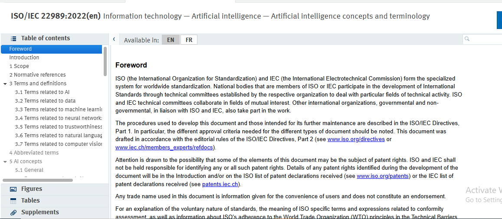

# ISO/IEC 22989:2022 — AI concepts and terminology

## Standard Profile
- **Domain:** Governance
- **Pack ID:** `gov-15-iso-iec-22989-2022-ai-concepts-and-terminology`
- **Version:** `1.0`
- **Jurisdiction:** International
- **Type:** ISO/IEC standard

## Official Standard Link
- [ISO/IEC 22989:2022 — AI concepts and terminology](https://www.iso.org/standard/74296.html)

## Website Screenshot
- 

## Brief Info
Reference checklist pack for ISO/IEC 22989:2022 — AI concepts and terminology. Jurisdiction: International. Type: ISO/IEC standard.

## How This Is Used In TrustStack
This standard is represented as a versioned pack and contributes checklist controls, expected evidence, and audit-ready mapping context.
